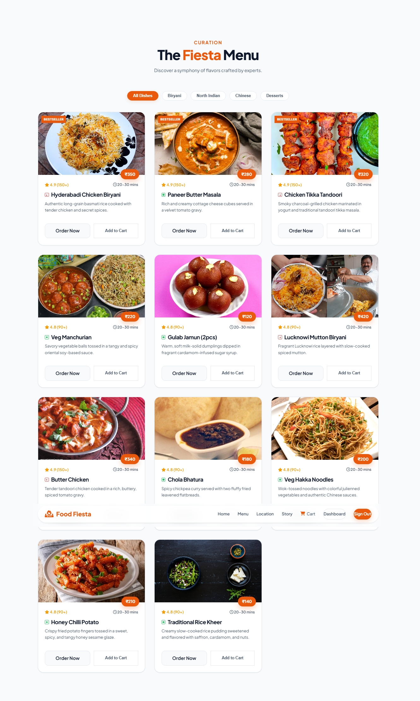
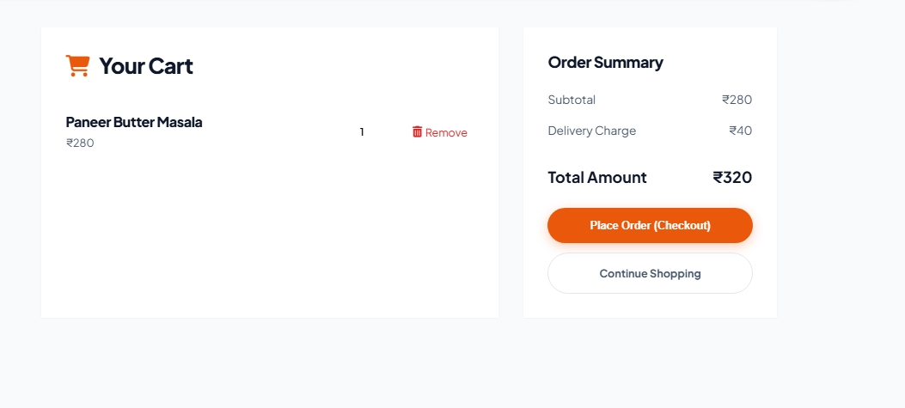
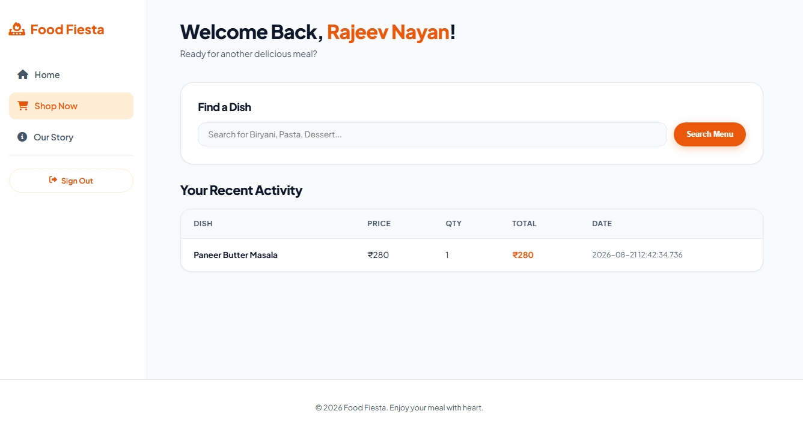

# Food Fiesta

**Live application:** [Food Fiesta | Culinary Excellence](https://food-fiesta-0sej.onrender.com/)

Food Fiesta is a Spring Boot 3.4.2 and Java 21 food-ordering platform with a geospatial and real-time delivery foundation. It uses PostgreSQL/PostGIS for durable spatial data, Redis Geo for live driver positions, STOMP WebSockets for tracking updates, Kafka for asynchronous driver routing, and Spring AI for delivery-time estimates.

## Architecture

```text
Browser / Mobile Client
        |
Spring MVC + REST + STOMP WebSocket
        |
Services: ordering, routing, tracking, ETA
   |          |            |         |
PostGIS     Kafka       Redis Geo  Spring AI
```

- **PostgreSQL + PostGIS:** restaurant, driver, and delivery geometry with GiST spatial indexes.
- **Flyway:** versioned schema ownership; Hibernate validates mappings only.
- **Redis Geo:** high-frequency driver-location updates and nearest-driver lookups.
- **STOMP WebSockets:** publishes driver updates to `/topic/drivers/{driverId}` and order status updates to `/topic/orders/{orderId}`.
- **Kafka:** checkout publishes `new-order-created`; a consumer reserves the nearest available driver.
- **Spring AI:** combines PostGIS delivery distance, restaurant prep time, and mocked traffic to calculate an ETA. It uses an OpenAI model when `OPENAI_API_KEY` is configured and otherwise returns the deterministic estimate.
- **Java 21 virtual threads:** enabled for high-fan-out HTTP and WebSocket handling.

## Application preview

### Home
<p align="center">
  
</p>

### Menu
<p align="center">
  
</p>

### Cart
<p align="center">
  
</p>

### Customer dashboard
<p align="center">
  
</p>

### API documentation
<p align="center">
  
</p>

## Prerequisites

- JDK 21
- Docker Desktop with Docker Compose
- An OpenAI API key only when AI-backed ETA refinement is required

## Environment variables

| Variable | Purpose | Default |
| --- | --- | --- |
| `SPRING_DATASOURCE_URL` | PostgreSQL/PostGIS JDBC URL | `jdbc:postgresql://localhost:5432/foodfiesta` |
| `SPRING_DATASOURCE_USERNAME` | Database user | `postgres` |
| `SPRING_DATASOURCE_PASSWORD` | Database password | `password` |
| `REDIS_HOST` | Redis Geo host | `localhost` |
| `REDIS_PORT` | Redis Geo port | `6379` |
| `KAFKA_BOOTSTRAP_SERVERS` | Kafka bootstrap server | `localhost:9092` |
| `MAP_ROUTING_BASE_URL` | OSRM-compatible routing API base URL | `https://router.project-osrm.org` |
| `OPENAI_API_KEY` | Enables Spring AI ETA refinement | unset |
| `OPENAI_CHAT_MODEL` | OpenAI chat model | `gpt-4o-mini` |
| `GOOGLE_CLIENT_ID` | Google OAuth client ID | unset |
| `GOOGLE_CLIENT_SECRET` | Google OAuth client secret | unset |

## Run locally

Create a `.env` file for local secrets:

```env
GOOGLE_CLIENT_ID=your_google_client_id
GOOGLE_CLIENT_SECRET=your_google_client_secret
OPENAI_API_KEY=your_openai_api_key
```

Start the complete platform:

```bash
docker compose up --build
```

The service is available at `http://localhost:8080`. Flyway automatically installs the baseline PostGIS schema, including the `postgis` extension, on the first database startup.

## Delivery APIs

Set the final delivery point before requesting an ETA:

```http
PUT /api/orders/{orderId}/delivery-location
Content-Type: application/json

{
  "lon": 77.5946,
  "lat": 12.9716
}
```

Retrieve the estimate:

```http
GET /estimate-delivery/{orderId}
```

A successful response includes the PostGIS distance, preparation time, mocked traffic delay, delivery minutes, estimated arrival timestamp, and whether the result came from `spring-ai` or the deterministic `heuristic` model. The endpoint returns `404` for an unknown order and `409` until a delivery location has been set.

Travel time is taken from an external OSRM-compatible routing API when reachable; otherwise it degrades to the straight-line PostGIS distance.

## Nearby-restaurant search

Search active restaurants within a radius using PostGIS `ST_DWithin`, ordered by true ground distance:

```http
GET /restaurants/nearby?lat=12.9716&lon=77.5946&radius=5km
```

`radius` accepts `km` or `m` (e.g. `5km`, `800m`, or a bare number treated as km) and is capped at 50 km; it defaults to `5km`. The response lists `id`, `name`, `address`, `avgPrepMinutes`, and `distanceMeters` for each match.

## Resilience

- **Circuit breaker (Resilience4j):** the external map-routing client runs behind a `mapRouting` circuit breaker (sliding window 10, 50% failure threshold, 10s open wait). When the vendor is slow or down, the breaker opens and the ETA path falls back to the straight-line estimate instead of cascading failures. Configure the vendor with `MAP_ROUTING_BASE_URL`.
- **Virtual threads:** `spring.threads.virtual.enabled=true` runs request and WebSocket handling on Java 21 virtual threads for high-fan-out concurrency.

## Real-time topics and APIs

| Capability | Endpoint or topic |
| --- | --- |
| Nearby restaurant search | `GET /restaurants/nearby?lat=&lon=&radius=5km` |
| Delivery location update | `PUT /api/orders/{orderId}/delivery-location` |
| Delivery ETA | `GET /estimate-delivery/{orderId}` |
| Driver location update | `POST /api/drivers/{driverId}/location` |
| Driver STOMP update | `/app/drivers/{driverId}/location` |
| Driver tracking subscription | `/topic/drivers/{driverId}` |
| Order status subscription | `/topic/orders/{orderId}` |
| Kafka order-routing topic | `new-order-created` |

## Deployment

Use a PostGIS-enabled PostgreSQL database, Redis, and Kafka for every deployed environment. Configure the environment variables above in the deployment platform; do not use the local defaults in production. The provided `docker-compose.yml` starts the application with compatible PostGIS, Redis, and Kafka services for local development.

## License

This project is licensed under the [MIT License](LICENSE).
