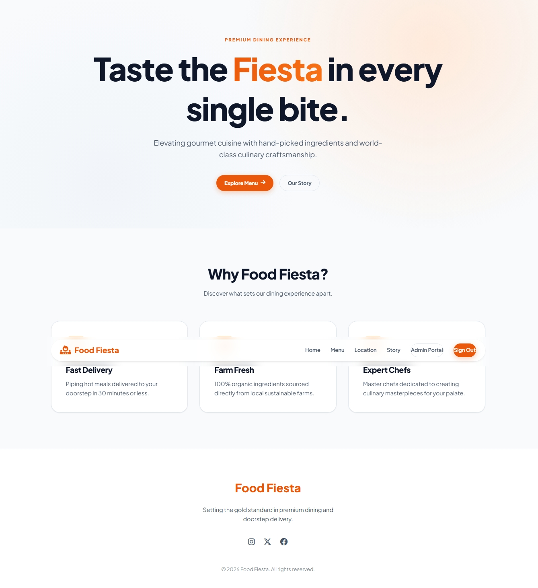
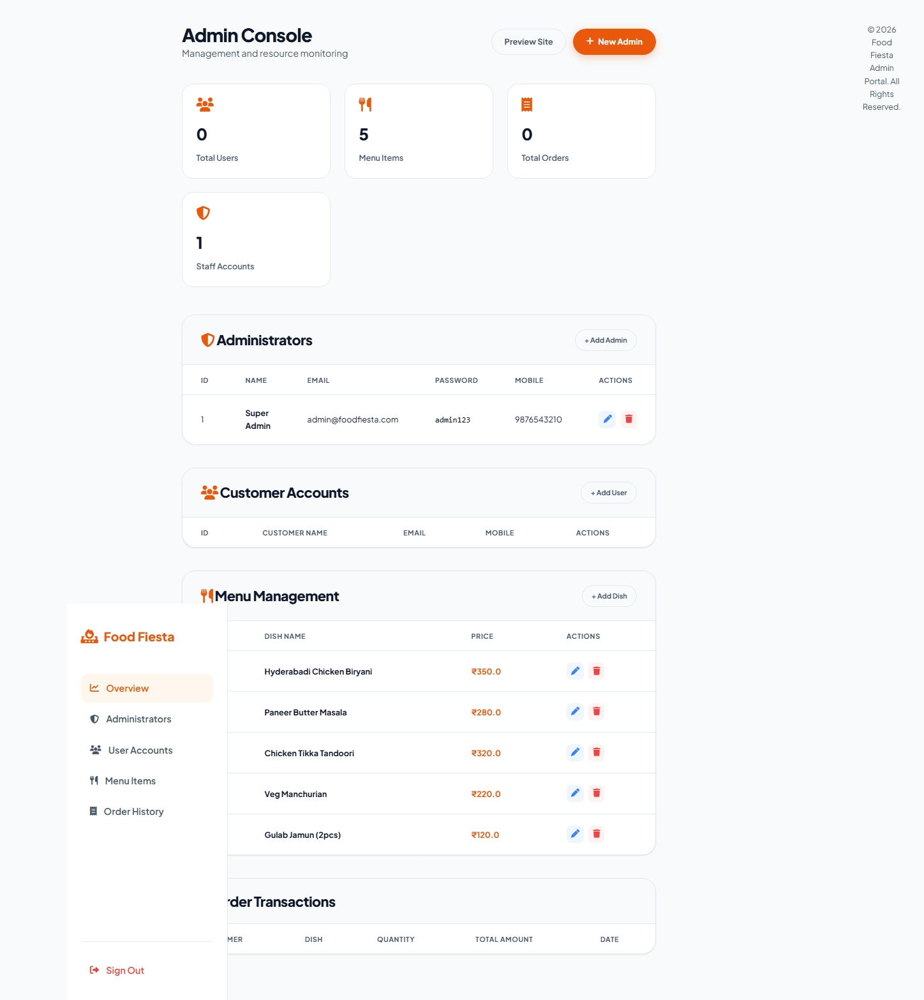

# 🍕 Food Fiesta - Full-Stack Spring Boot Project

Welcome to **Food Fiesta**, a modern dining management and ordering system. This project is built using the **Spring Boot** framework (Java's most popular backend framework) and is designed to be very easy to run and learn from—even if you are completely new to Java!

---

## 💡 What is this project?

Food Fiesta is a **Full-Stack Application**, which means it has:
1. **Frontend (The User Interface)**: Built using HTML pages enhanced by **Thymeleaf** (a templating engine that allows Java to insert data into HTML pages) and styled with modern CSS.
2. **Backend (The Core Logic)**: Powered by **Spring Boot**, which acts as a server to handle user requests, process orders, and manage authentication.
3. **Database (Data Storage)**: Uses an **H2 In-Memory Database** by default (ideal for beginners as it requires zero database setup and runs inside your computer's memory).

---

## 🛠️ Tech Stack & Key Concepts

If you are new to Java or backend development, here are the key pieces used in this project:

- **Java 21**: The programming language used to write the application logic.
- **Spring Boot 3.4.2**: The framework that handles web routing, server setup, and dependency injection.
- **Spring Data JPA & Hibernate**: Tools that translate Java code into database tables and queries, meaning you don't need to write raw SQL!
- **H2 Database**: A lightweight database that starts up instantly inside the app's memory. *Note: Data resets when the application stops.*
- **Swagger/OpenAPI**: An interactive page that automatically documents and lets you test the web endpoints.

---

## 🖥️ Preview of the Application

### 🏠 Home Page
<p align="center">
  
</p>

### 🔑 Authentication & Admin Portal
<p align="center">
  
  
</p>

---

## 📋 Prerequisites for Beginners

Before you start, you only need one tool installed on your computer:
- **Java Development Kit (JDK) 21**: Download and install it from [Oracle](https://www.oracle.com/java/technologies/downloads/) or [Eclipse Temurin](https://adoptium.net/).
- *Note: You do NOT need to install Maven. We have included a tool called the "Maven Wrapper" (`mvnw`) which automatically downloads Maven for you when you run the startup command.*

---

## 🚀 Step-by-Step Quick Start

### 1. Clone the Project
Open your terminal (macOS/Linux) or Command Prompt/PowerShell (Windows) and type:
```bash
git clone https://github.com/imrajeevnayan/Food-Fiesta.git
cd Food-Fiesta
```

### 2. Run the Application
Run the command below based on your operating system:

*   **Windows (PowerShell)**:
    ```powershell
    .\mvnw.cmd spring-boot:run
    ```
    *(If PowerShell displays an error about `JAVA_HOME` not found, set the environment variable pointing to your JDK folder first, then run it)*:
    ```powershell
    $env:JAVA_HOME="C:\Program Files\Java\jdk-21"
    .\mvnw.cmd spring-boot:run
    ```
*   **macOS / Linux (Terminal)**:
    ```bash
    chmod +x mvnw
    ./mvnw spring-boot:run
    ```

### 3. Open in Your Browser
Once the terminal outputs `Started FoodFrenzyApplication in ... seconds`, open:
- **Web App**: [http://localhost:8080/](http://localhost:8080/)
- **Swagger API Docs**: [http://localhost:8080/swagger-ui/index.html](http://localhost:8080/swagger-ui/index.html)
- **H2 Database Console**: [http://localhost:8080/h2-console](http://localhost:8080/h2-console)
  - *Connection Settings:*
    - **JDBC URL**: `jdbc:h2:mem:foodfiesta`
    - **User Name**: `sa`
    - **Password**: *(leave blank)*

---

## 👤 Default Accounts (Pre-Seeded)

The application automatically seeds a default administrator account into the database on startup so you can test admin actions immediately:
- **Admin Email**: `admin@foodfiesta.com`
- **Admin Password**: `admin123`

---

## 📁 Project Structure Explained

Here is where to find the important files:
- `src/main/java/com/example/demo/controllers/`: Java classes that route requests to HTML pages (e.g. `/home` or `/products`).
- `src/main/java/com/example/demo/entities/`: Java models representing database tables (`User`, `Admin`, `Product`, `Orders`).
- `src/main/resources/templates/`: The HTML pages rendered by Thymeleaf.
- `src/main/resources/static/`: Frontend stylesheets (CSS), JavaScript files, and images.
- `src/main/resources/application.properties`: Configuration settings (database credentials, server ports).

---

## 📦 Building the App for Deployment

If you want to package the application into a single executable file (`.jar`), run:
- **Windows**: `.\mvnw.cmd clean package`
- **macOS/Linux**: `./mvnw clean package`

The compiled output will be generated inside the `target/` directory.

---

## 📄 License
This project is licensed under the MIT License. See [LICENSE](LICENSE) for details.

*Developed by **imrajeevnayan***
